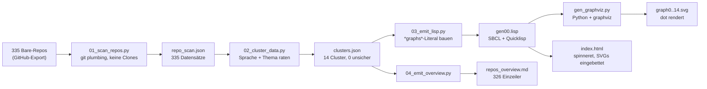
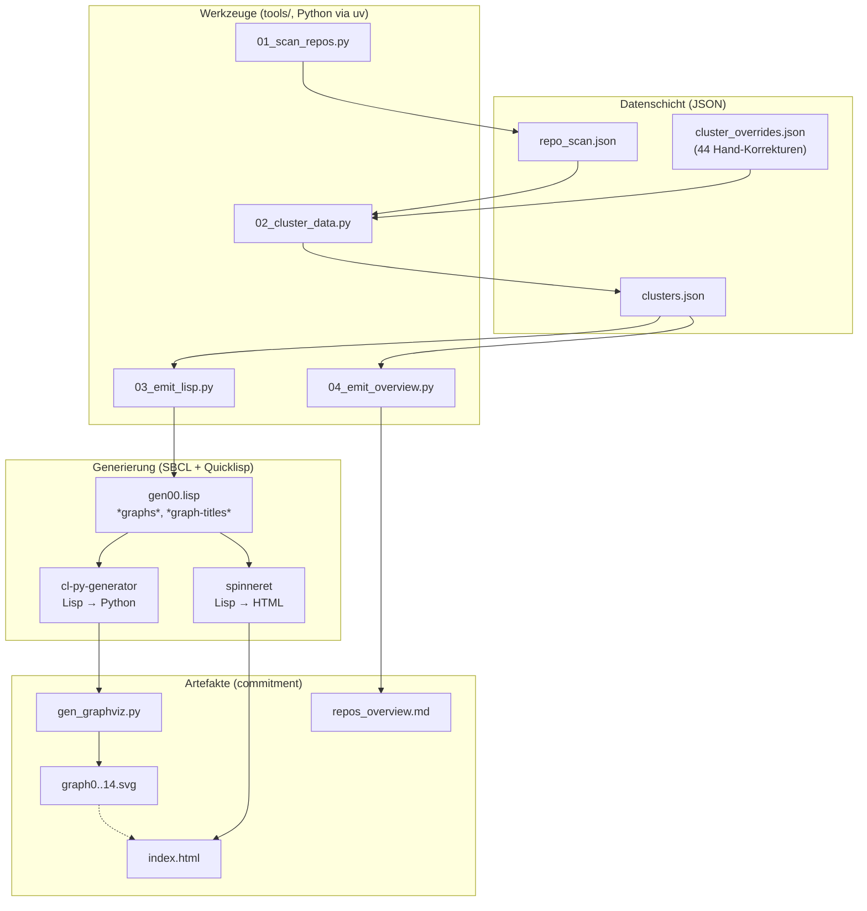

# Walkthrough: Das Repository-Diagramm ist wieder vollständig

*Was passiert, wenn man 335 Git-Repositories in 15 hübsche Bilder verwandelt —
und was dabei alles schiefgehen kann.*

## 1. Das Big Picture: Was wurde implementiert?

Auf [plops.github.io](https://plops.github.io) hing jahrelang ein Diagramm, das
nur einen Bruchteil der eigenen GitHub-Repositories zeigte: Vier von Hand
gepflegte Graphen, fest verdrahtete Pfade wie `/home/martin/stage/…`, und
keinerlei Chance, jemals wieder aktuell zu werden. Jetzt ist das Diagramm aus
einem Guss neu gebaut — **automatisiert, vollständig und reproduzierbar**:

| Kennzahl | Wert |
|---|---|
| Exportierte Repositories | 335 |
| Davon mit Inhalt analysiert | 326 |
| Leere Repos (kein einziger Commit) | 3 (`dwm`, `learn-cl-object-orient`, `thesis`) |
| Reine Wiki-Repos | 6 |
| Themen-Cluster | 14 |
| Generierte Diagramme (SVGs) | 15 (14 Cluster + 1 Übersicht) |
| Knoten mit totem Link | 0 |

Jeder blaue Knoten in den SVGs ist klickbar und führt direkt zum Repository.
Die Startseite (`index.html`) bettet alle 15 Diagramme unter eigenen
Überschriften ein. Daneben gibt es eine [Textübersicht](../../repos_overview.md)
mit einem Satz Beschreibung pro Repository — ebenfalls gruppiert und verlinkt.

Die Pipeline sieht so aus:



Und so hängt alles zusammen, wenn man es als Schichten zeichnet:



Der Clou: **Alles ist regenerierbar.** Kommt ein neues Repository dazu, läuft
man die sechs Befehle aus der `deps.md` erneut — Scan, Clustering, Lisp,
Python, HTML — und die Seite ist wieder aktuell. Kein Hand-Editieren von
Kantenlisten mehr.

> **Begriffsklärung: Was ist ein Digraph?** Ein *Graph* ist in der
> Informatik eine Menge von **Knoten** (Punkten), die durch **Kanten**
> (Linien) verbunden sind — ideal, um Zusammengehörigkeit zu zeigen. Ein
> **Digraph** (*directed graph*, gerichteter Graph) legt zusätzlich pro
> Kante eine Richtung fest (mit Pfeilspitze), also z. B. „Thema →
> Repository" statt nur „hängt zusammen". Das Programm **`dot`** aus dem
> Paket **Graphviz** berechnet aus einer solchen Kantenliste automatisch
> ein übersichtliches Layout (wer kommt nach oben, wo laufen die Pfeile
> lang) und rendert es als SVG — eine Vektorgrafik, die im Browser
> beliebig zoombbar bleibt und klickbare Links enthalten kann. Genau
> deshalb ist jedes blaue Repository-Rechteck in unseren Diagrammen ein
> Link auf GitHub.

## 2. Wie man 335 Bare Repositories liest, ohne sie zu klonen

### Was ist ein Bare Repository?

Normalerweise sieht ein Git-Repository so aus: ein Ordner mit Quellcode plus
einem versteckten `.git`-Verzeichnis, in dem die Historie liegt. Ein **Bare
Repository** ist nur die Historie *ohne* ausgecheckten Quellcode — also quasi
nur der Inhalt von `.git`, direkt im Ordner (`HEAD`, `config`, `objects`, …).
GitHub-Exporte und Server-Repositories liegen fast immer in dieser Form vor;
man erkennt sie an der Endung `.git`.

Man kann daraus trotzdem alles lesen — mit sogenannten **Plumbing-Befehlen**
(von *plumbing*, „Rohrleitung": die niedrigen Git-Bausteine, aus denen die
bekannten Porcelain-Befehle wie `git status` zusammengesetzt sind):

```sh
# Welche Dateien gibt es im neuesten Commit?
git --git-dir=/pfad/zu/cl-rust-generator.git ls-tree -r HEAD --name-only

# README direkt aus der Historie lesen (ohne Checkout!)
git --git-dir=/pfad/zu/cl-rust-generator.git show HEAD:README.org

# Wann war der letzte Commit, und was stand drin?
git --git-dir=/pfad/zu/cl-rust-generator.git log -1 --format=%ci%x00%s
```

Genau diese drei Befehle nutzt `01_scan_repos.py` pro Repository. Warum kein
vollständiges Klonen? Weil 335 Arbeitskopien mehrere Gigabyte Platte und viel
Zeit kosten würden — für eine Klassifizierung reichen Dateinamen,
Markerdateien und die ersten README-Zeilen völlig aus.

### Was der Scanner einsammelt

Pro Repository speichert `repo_scan.json` einen Datensatz wie diesen
(hier gekürzt):

```json
{
  "name": "py-sam",
  "status": "ok",
  "file_count": 12,
  "top_extensions": [[".py", 1], [".toml", 1], [".md", 8]],
  "markers": ["pyproject.toml"],
  "readme_path": "README.md",
  "readme_head": "Sterne in Smartphone-Fotos …",
  "last_commit_date": "2026-08-29 …",
  "last_commit_subject": "chore: clean up"
}
```

Drei Design-Entscheidungen stecken darin, die sich alle erst durch
Fehlschläge als nötig erwiesen haben:

1. **Badges werden herausgefiltert.** Fast jedes README beginnt mit
   [Shield-Badges](https://shields.io) (`[]`) oder einem
   ``-Logo. Diese Zeilen enthalten das Wort `svg` — und hätten
   `bincode` (eine Rust-Serialisierungsbibliothek!) als Grafikprojekt
   klassifiziert. Deshalb verwirft der Scanner alle Zeilen mit `![`,
   `<img` oder `badge`.
2. **Markerdateien schlagen Dateiendungen.** Eine `Cargo.toml` beweist
   Rust stärker als zehn `.md`-Dateien Python beweisen würden. Die
   Sprachwahl ist daher eine gewichtete Abstimmung: Marker geben bis zu
   10 Punkte, Dateiendungen 1–3 pro Datei.
3. **Sonderfälle sind erstklassig.** Repositories ohne `HEAD` (kein
   einziger Commit!) und `*.wiki.git`-Repos bekommen einen eigenen
   Status statt einer erfundenen Sprache. Die drei leeren Repos
   (`dwm`, `learn-cl-object-orient`, `thesis`) landen dokumentiert in
   der Textübersicht statt kommentarlos unterzugehen.

### Warum die Sprache wichtig ist

Die erkannte Sprache dient doppelt: Sie steht in der Textübersicht
hinter jedem Repository (`(rust)`, `(lisp)`, …), und sie ist das
Fallback-Kriterium, wenn kein Themen-Stichwort passt. Ein unbekanntes
Rust-Programm landet so wenigstens bei den Rust-Anwendungen statt im
Nirgendwo.

## 3. Clustering: Wie 326 Repos in 14 Schubladen kamen

### Das Regelwerk

`02_cluster_data.py` arbeitet in drei Stufen — erst der Name, dann das
README, dann die Sprache:

1. **Name trifft (Konfidenz: hoch):** Enthält der Repository-Name ein
   Stichwort (`pluto`, `arduino`, `cuda`, …), ist die Sache klar.
2. **README trifft (mittel):** Sonst wird in README-Kopf und letzter
   Commit-Nachricht gesucht — aber strenger (siehe unten).
3. **Sprach-Fallback (mittel/niedrig):** Sonst entscheidet die Sprache,
   z. B. Lisp → `lisp-libs`, Rust → `rust-apps`.

Die Stichwort-Tabellen liegen bewusst **nicht** im Python-Code, sondern
in `tools/cluster_data.json` — so bleibt das Skript unter 200 Zeilen
(weit unter dem 600-Zeilen-Limit) und die Wortlisten sind ohne
Programmierkenntnisse pflegbar.

### Die Tücken der Teilzeichensuche (mit Anekdoten)

Der erste Clustering-Lauf war ein Lehrstück dafür, warum naive
Substring-Suche scheitert. Jede dieser Fehlklassifizierungen ist echt
passiert und hat zu einer Regelverbesserung geführt:

| Stichwort | Falscher Treffer | Ursache | Lösung |
|---|---|---|---|
| `sar` (Radar) | Jedes README mit „necessary" | Teilzeichen in normalem Englisch | Kurze Stichwörter (unter 5 Zeichen) gelten nur als **ganzes Wort** |
| `quest` (VR/Spiele) | `cl-week-calendar` | … in „re**quest**"! | `quest` und `andor` immer nur als ganzes Wort |
| `spi` (Bussystem) | `spiral-sample`, `transpiled_treemap` | … in „**spi**ral", „tran**spi**led" | Auch im Namen: kurze Wörter brauchen Wortgrenzen (Ziffern erlaubt, daher trifft `fft` weiter `fft3`) |
| `uart` | `quartz-model` | … in „qu**uart**z" | dto. |
| `andor` (Kamerahersteller) | `cl-yasm-golang` | … in „**and/or**"! | dto. |
| `generator` | `libcoro`, `pages`, … | Jedes README erwähnt irgendwo „Generator" | Der Cluster `generators` matcht **nur im Namen** |
| `http` | Fast jedes README mit Link | `http://…` in URLs | Nur im Namen wirksam |
| `forex` (Devisen) | `uVkCompute` (Vulkan!) | … in „**for ex**ample"! | Stichwort gestrichen |
| `backtest` (Trading) | `cl-cffi-callback-test` | … in „call**backtest**" (Wortklebung) | Stichwort gestrichen |
| `notes` (Doku) | `clicc`, `View5D.jl` | „note that …" steht überall | Stichwort gestrichen |

Die Lehre in einem Satz: **Je kürzer das Stichwort, desto strenger muss
der Vergleich sein** — und manche Wörter (`express` in „expression"!)
sind als Suchbegriffe schlicht unbrauchbar.

### Die Override-Liste: Wo der Mensch gewinnt

44 Repositories (13 %) sind per Hand in `tools/cluster_overrides.json`
korrigiert — mit Begründung, damit die Entscheidung nachvollziehbar
bleibt und ein erneuter Skriptlauf sie nicht verliert. Die schönsten
Fälle:

- **`py-sam` → Embedded statt Machine Learning.** `sam` riecht nach
  Metas „Segment Anything"-Modell — tatsächlich ist es eine
  Barcode-Demo für den **SAM31-Mikrocontroller**. Ohne Lesen des
  README ununterscheidbar.
- **`stars` und `py-stars` → Wissenschaft statt SDR.** Beide erwähnen
  „satellite" und „pluto" — aber als **Himmelsobjekte**
  (Astrofotografie mit Plate-Solving), nicht als Funksatelliten.
- **`matlab-mma-resample-sim` → Wissenschaft statt ML.** Enthält
  „resample" — darin steckt `sam`, aber garantiert kein
  Segment-Anything.
- **`copy-cat` → Machine Learning.** Kein Katzenkopierer, sondern
  Hofstadters/Mitchells berühmte kognitive Architektur „Copycat".
- **`View5D.jl` → Mikroskopie.** Ein 3D-Viewer für Mikroskopiedaten in
  Julia/Java — der Name verrät es nur Eingeweihten.
- **`ryzen_managment_linux` → Wissenschaft.** Kein Mikrocontroller
  („microcontroller" stand im README), sondern ein
  Datenerfassungs-Toolkit für AMD-Ryzen-Sensoren.

Extern validiert wurde das Bild stichprobenartig über DeepWiki: Die
KI-Zusammenfassung von `plops/cl-rust-generator` bestätigt z. B., dass
der Generator ein „flacher Syntax-Transformator" ist (`emit-rs`
übersetzt S-Expressions in Rust-**AST**-Text — also in die
Baumdarstellung des Programms —, `write-source` schreibt nur bei
Änderung). Solche Querchecks sind billig und fangen grobe
Missverständnisse — für wenige, gezielt gewählte Repositories lohnt
sich das.

### Anomalien im Datenbestand

- **Drei Repositories sind völlig leer** — nicht einmal ein Commit.
  `git rev-parse HEAD` schlägt fehl; das Skript meldet `empty` statt
  abzustürzen.
- **Acht Repository-Namen enthalten Großbuchstaben oder Punkte**
  (`View5D.jl`, `plops.github.io`, `JLCPCBBasicLibrary`, …). Das wurde
  zum Stolperstein in der Lisp-Generierung (siehe Abschnitt 4):
  Lisp-Symbole werden standardmäßig großgeschrieben, der
  Python-Generator kleingeschrieben — beides hätte URLs und Labels
  verfälscht. Lösung: Knoten und Links sind jetzt exakte Zeichenketten.
- **168 von 326 Repositories haben kein README.** Dort entscheiden
  Dateiendungen, Markerdateien und Commit-Texte — ein Grund, warum der
  Sprach-Fallback so wichtig ist.
- **`rust-apps` und `python-apps` sind fast leer** (4 bzw. 0 Repos):
  Fast alle Rust-/Python-Repos ließen sich thematisch zuordnen
  (Grafik, ML, Wissenschaft …). Das ist kein Fehler, sondern ein
  Gütezeichen — der Fallback musste selten einspringen.

## 4. Learnings: Was wir mitnehmen (und was als Nächstes kommt)

### Drei Bugs, drei Lektionen

**1. Die fehlende Klammer.** Der erste SBCL-Lauf starb mit
`END-OF-FILE` — irgendwo eine Klammer zu wenig auf 670 Zeilen Lisp.
Statt zu raten, hat ein kleiner Tiefenzähler (Klammertiefe pro Zeile
ausgeben) die fehlerhafte Top-Level-Form in Sekunden eingekreist — und
dann zeigte sich die eigentliche Falle: Die Klammern waren zwar
balanciert, aber **falsch platziert** (`s)))` statt `) s))`), sodass
der Datei-Stream als HTML-Kind statt als `write-sequence`-Argument
landete. Lektion: Bei Lisp-Fehlern erst zählen, dann denken.

**2. Der Graph ohne Label.** Die Python-Bibliothek `graphviz` akzeptiert
`label` nicht als Konstruktor-Argument (`Digraph(format="svg",
label=…)` wirft `TypeError`). Statt in der Lisp-DSL eine
Dictionary-Syntax zu raten, wurde das Label gestrichen — die
Überschriften in `index.html` erfüllen denselben Zweck. Lektion: Wer
eine Fassade (Lisp-DSL) vor einer Fassade (Python-API) vor einem Tool
(`dot`) baut, sollte optionale Features beim ersten Widerstand streichen.

**3. Der doppelte Generierungslauf.** `index.html` bettet die SVGs zur
SBCL-Laufzeit ein — aber die SVGs entstehen erst danach durch Python.
Also braucht es die Reihenfolge **SBCL → Python → SBCL**. Das steht
jetzt als Kommentar in `gen00.lisp` und in der `deps.md`, damit es
nicht wieder jemand vergisst.

### Mögliche Erweiterungen

- **CI-Auto-Update:** Ein GitHub-Action-Workflow könnte Export, Scan
  und Regenerierung monatlich anstoßen und als Pull Request
  vorschlagen.
- **Volltext-Clustering:** Statt Stichwortlisten könnten README-Embeddings
  (z. B. via Sentence-Transformers) ähnliche Repositories automatisch
  gruppieren — die aktuelle Override-Liste wäre dafür ein perfekter
  Evaluierungsdatensatz.
- **Interaktivität:** Die statischen SVGs könnten durch eine
  durchsuchbare Seite (Filter nach Sprache/Jahr/Thema) ergänzt werden;
  `clusters.json` + `repo_scan.json` liefern alle Daten dafür bereits.
- **Vorschaubilder:** Viele Grafik-Repos enthalten `.png`-Demos — eine
  Galerie wäre ein schöner Blickfang.

## 5. Pakete für das Dockerfile

Folgende Programme und Pakete werden dauerhaft benötigt und sollten in
das AI-Umgebungs-Dockerfile (`03_ai_env/Dockerfile`) aufgenommen werden,
soweit noch nicht enthalten:

| Paket | Typ | Begründung |
|---|---|---|
| `graphviz` (apt, liefert `dot` 14.x) | System | Rendert die SVGs; **fehlte** im Image |
| `sbcl` + Quicklisp (`alexandria`, `spinneret`) | System/Lisp | Führt `gen00.lisp` aus; Quicklisp-Setup bereits vorhanden |
| `cl-py-generator` (via `local-projects`-Symlink) | Lisp | Lisp→Python-Transpiler; Symlink bereits vorhanden, `gen00.lisp` registriert ihn jetzt selbst |
| `graphviz` (Python, via `uv`) | Python | Python-API für `dot` (`gen_graphviz.py`) |
| `ruff` (via `uv`) | Python | Lint + Format für `tools/*.py` |

Die vollständige Befehlsfolge zur Reproduktion (von `uv venv` bis zur
fertigen Seite) steht in der [`deps.md`](../../deps.md).
